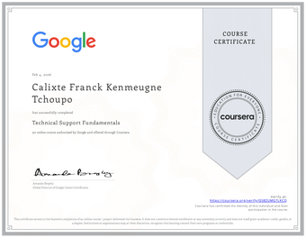
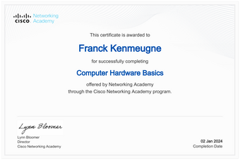
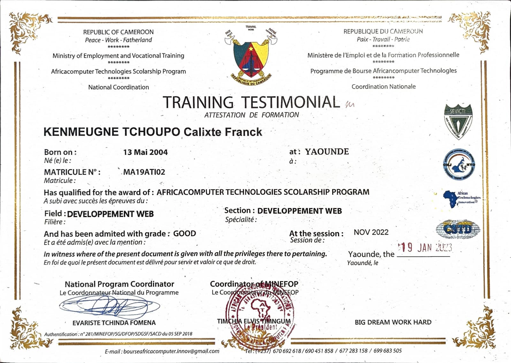
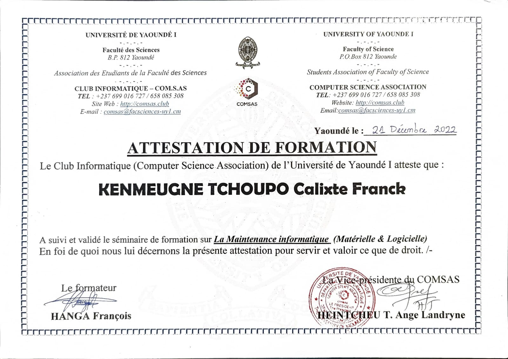

**Développeur Full-Stack & Designer Graphique**, en formation continue : Bachelor Administration Systèmes, Réseaux & Cloud (IMIE Paris) → Master Cybersécurité & Cloud Computing en alternance dès octobre 2026. Je construis des projets web, d'automatisation et de sécurité entre deux cours.

 

## 👋 À propos

- 🌱 En apprentissage : Cybersécurité, Cloud, DevSecOps
- 🗺️ Feuille de route : CCNA · CompTIA Security+ · AWS Cloud Practitioner
- 💬 Français natif · Anglais courant (scolarité complète en anglais)
- 📍 Nemours, France

### 🔎 Ouvert aux opportunités

Actuellement en recherche d'un **stage de 2 mois en support IT / administration systèmes**, disponible dès le **21 septembre 2026** (Île-de-France). Ouvert aussi à toute mission en cybersécurité, cloud ou développement qui me permet d'apprendre sur le terrain.

 

## 🎓 Certifications

## 🛠️ Compétences

**Développement**

**DevSecOps & Cloud**

**Design**

## 📌 Projets phares

- 🛡️ **[devsecops-pipeline-fr](https://github.com/Franck2040/devsecops-pipeline-fr)** — Template CI/CD DevSecOps souverain NIS2/ANSSI : pipeline GitHub Actions 7 couches (Gitleaks, Semgrep, Trivy, npm audit, Checkov, Syft, OWASP ZAP), modèle de menace STRIDE
- 🛒 **[techfind](https://github.com/Franck2040/techfind)** — Boutique e-commerce (Next.js, TypeScript, Prisma, PostgreSQL) — [démo en ligne](https://techfind-orpin.vercel.app)
- ⚙️ **[n8n-veille-emploi-fr](https://github.com/Franck2040/n8n-veille-emploi-fr)** — Workflow n8n : Gmail → extraction IA (Gemini) → déduplication → Notion → notification
- 🩺 **[health-tracker](https://github.com/Franck2040/health-tracker)** — Suivi santé (Java, Spring Boot, Spring Data JPA, Thymeleaf)

## 📊 Statistiques GitHub

